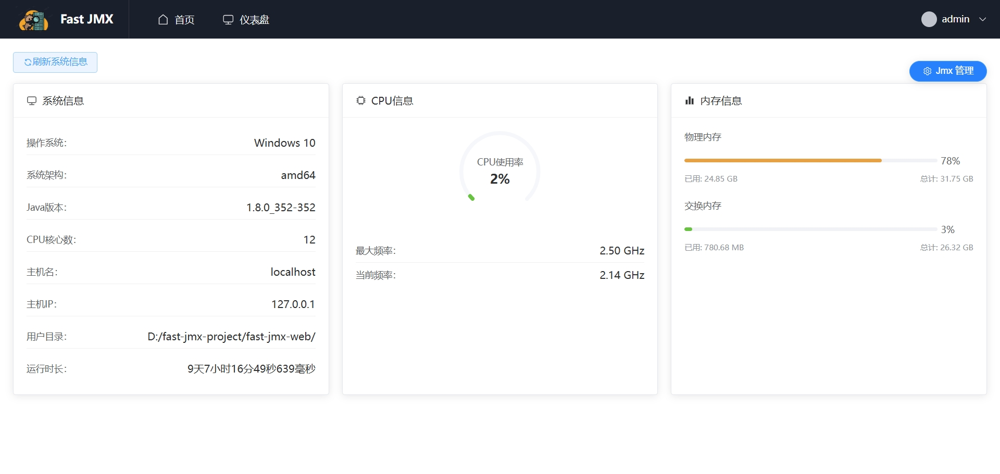
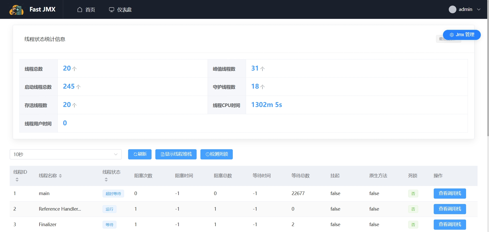
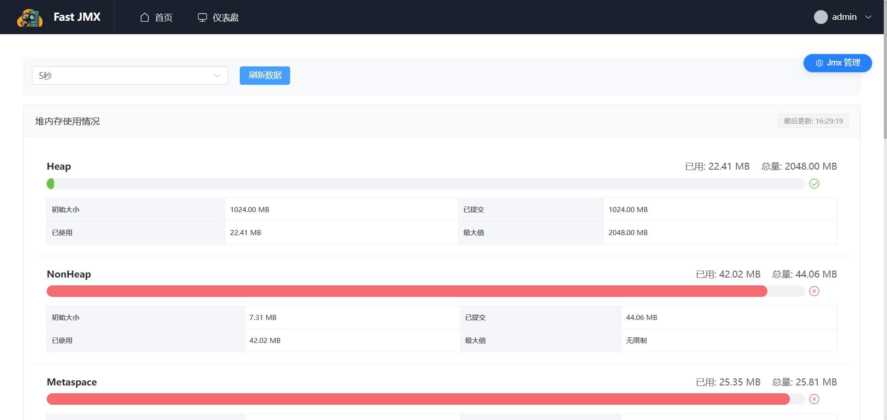
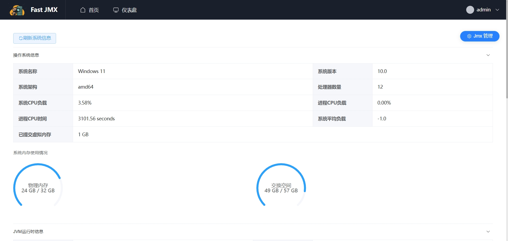
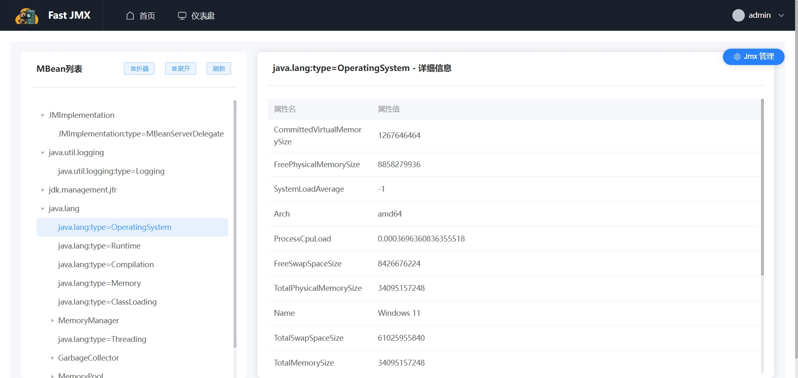
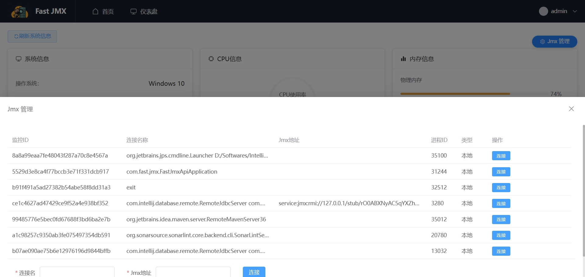

# Fast-Jmx

## 项目简介

此项目是一个基于 Spring Boot 的 JMX 管理工具，用于监控和操作 Java 应用程序。思路来源是 [https://github.com/huzhicheng/little-flower](https://github.com/huzhicheng/little-flower)，在这位老师的基础上增加了一点点功能，也很感谢这位老师开源的代码。这个项目也是作为一个研究 `jmx` 的项目，目前还处于开发阶段，会持续的完善这个项目，使得更加完整。

前端地址：[https://github.com/aim467/fast-jmx-api](https://github.com/aim467/fast-jmx-api)

## 主要功能

1. **当前系统信息查看**

2. **指定 VM 进程的线程列表查看**

3. **指定 VM 进程堆内存和非堆内存，以及内存池查看**

4. **指定 VM 进程的 VM 信息展示**

5. **指定 VM 进程的 MBean 列表浏览**

6. **JMX 连接管理面板**

